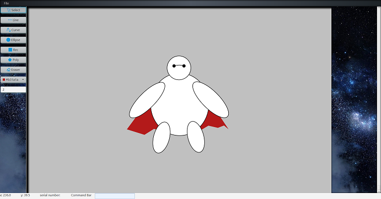
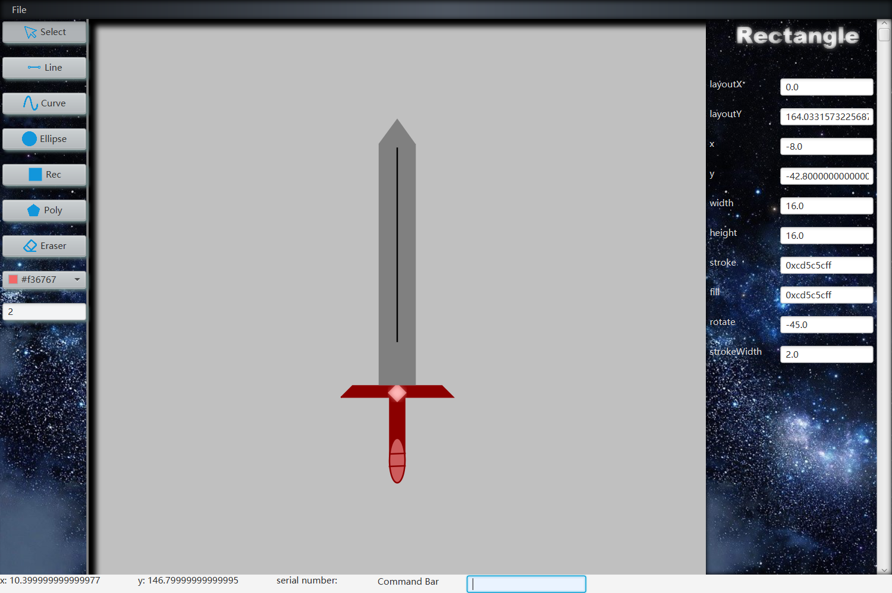

# Drawing Object 对象画板
> ***To create a simple way to design a JavaFX object***
  

## 用途及背景
 **&emsp;在做Java图形化的时候，尤其是做一些小游戏/控件之类的时候，开发者往往需要一边调试参数，一边运行程序看效果是否达到了预期。而目前市面上应用最广的SceneBuilder也有其局限性，在做界面的时候的确可以带来便利，而去抠细节的时候也会非常麻烦。而这个项目对象画板就是为了避免这种小巧控件设计/游戏人物绘制/时间轴动画反复调参而产生的。 对象画板利用Java原生几何图形格式（例如：Line/Ellipse/Rectangle）这些非常熟悉的shape，来最终构造出一个几何图形的集合，最终反回到开发者手上一个Group类对象。你不光可以用它设计图形，也可以用它来加载你通过Java写出的Group到画板上，让你可以做出一些修改/美化，当然最简单的将其保存为图片也不是问题，但这并不是这个项目的用意所在。**
## 使用说明
### 绘图
* 图形绘制
     * 线段：  
        简单地拖动以画出线段。
     * 曲线：  
        贝塞尔曲线，拖拽以画出一条直线，继续点击或拖拽来绘制剩余两个控制点，
        如需继续调整则继续点击，鼠标右键来停止绘制。
     * 椭圆：  
        简单拖拽以绘制，按住shift以绘制正圆。
     * 矩形：  
        简单拖拽以绘制，按住shift以绘制正方形。
     * 多边形：
        点击或拖拽画出第一条边，其后再绘制点击或拖拽添加边，鼠标右键来停止绘制并自动首尾相连。
     * 选择：  
        框选或单击选择(左键)。
     * 拖动：  
        右键按住选择图形进行拖动。
     * 橡皮：  
        点击或拖拽到图形来完成擦除。
     * 删除：  
        选中要删除的一个或多个图形，按下Delete删除，或者再内置的Command Bar中键入delete。
     * 颜色选择器：  
        选择下一个绘制图形的颜色。绘制图形之后也可以进行颜色的更改，但需要选中图形，在其属性栏中更改属性。
    * 笔触宽度：  
        输入一个正实数，控制下一个图形的边框宽度。
* 图形属性更改：  
     * 通过选择某一个或几个节点来使右侧属性栏显示属性，并输入相应的值使其改变。
     * 也可以通过内置的command bar（位于界面的底部），输入find命令（格式：find \[serialNumber\]）, serial number即所寻找的图形在group中的图层（getChildren()的list中的索引）。  
     e.g.  find 0（相对应的右侧属性栏会显示图层0中的图形属性）
     * 图层更改通过在command bar中键入change [fromSerialNum] [toSerialNum]  
     e.g. change 0 1 (将图层0图形插入到图层1)
#### 其他command bar命令
 除上述find 和 change外还有 create 和 delete 语法分别为 create [Type](e.g. create line)和delete [serialNum],
 如果当前已选中某个或多个图形, 可直接键入delete将选中元素全部删除
### 保存和导出
* 保存  
    保存采用的文件格式为文本格式，可直接用文本编辑器打开，并进行修改，记录了图形在group中的顺序和各个图形一些关键属性,
    将制作好的图形组合保存为该格式即可。
* 导出  
    导出图形为图片格式（包括但不限于png/jpg等格式）
### ***以gsdl格式导入至你的JavaFX程序中***
* 通过导入本项目的jar包，调用gsdl包下DefaultDeserializer类  
例如：
```java
private class Test
{
    public static void main(String[] args)
    {
        Deserializer deserializer = new DefaultDeserializer(file); // file 为你保存的gsdl文件
        Group group = deserializer.getObject();// 该group即为你所绘制的图形集合
    }
}
```
* 进阶用法  
假如你想以特殊的方式将你所绘制的图形加入到你的程序之中，请继承Deserializer抽象类，重载add(Shape shape)方法  
例如： 本例中我想将我所绘制的图形加入到已有的group之中，且每个节点绑定一个事件监听器
```java
private class Test
{
    public static void main(String[] args)
    {
        Group group = new Group();//已存在的group，本例中将图形加入该group
        group.getChildern().add(new Circle(200));//group本已经保存了一些图形，本例中将向该group添加更多图形
        Deserializer deserializer = new Deserializer(file)//file为你保存的gsdl文件
        {
            @Override
            protected void add(Shape node)
            {
                group.getChildren().add(node);
                node.setOnMouseClicked(event ->//鼠标点击每个新加入的图形将会触发该事件并输出"Clicked".
                {
                    System.out.println("Clicked");
                });
            }
        };
    }
}

```
### ***以gsdl格式从你的JavaFX程序中导出Group***
* 同样通过导入本项目jar包，调用gsdl包下Loader类来实现对你的图形进行美化/再加工  
例如：
```java
private class Test
{
    public static void main(String[] args)
    {
        Group group = new Group();//已存在的group，本例中将图形加入该group
        group.getChildern().add(new Circle(200));//group本已经保存了一些图形，本例中将向该group添加更多图形
        Loader loader = new Loader(file);//file是你提供的保存你的Group的gsdl文件
        loader.operate(object);//object是你要保存的Group
    }
}

```

*然后接下来就是利用画板模块来打开你刚才所翻译的gsdl文件，然后就对你的object进行美化和再加工吧*


### ***设计独特的小控件***

```java
public class Test1 extends Application // gsdl包下Test1文件，推荐运行
{
    @Override
    public void start(Stage primaryStage) throws IOException
    {
        Pane pane = new Pane();
        File file = new File("testingFile/ant.gsdl");
        Deserializer deserializer = new DefaultDeserializer(file);
        Group object = deserializer.getObject();
        object.setLayoutX(300);
        object.setLayoutY(250);
        Label label = new Label("Click");
        label.setScaleX(3);
        label.setScaleY(3);
        object.getChildren().add(label);
        object.setOnMouseClicked(event ->
        {
            object.setLayoutX(new Random().nextDouble()*800);
        });
        pane.getChildren().add(object);
        Scene scene = new Scene(pane,888,500);
        primaryStage.setScene(scene);
        primaryStage.show();
    }
}

```
效果图如下

> 强烈推荐打开我们gsdl中的Test类运行一下以了解该对象画板的强大之处！

## 代码说明  
> 文档最后更新于19/01/09
* [项目结构](docs/project_structure.md)
----
* [驱动类](docs/Main.md)
* [Cursor转换类](docs/ChangeCursor.md)
----
* [主面板](docs/MainPane.md)
    * [Top](docs/MenuBar.md)
    * [Left](docs/ToolBar.md)
    * [Right](docs/PropertyBar.md)
    * [Bottom](docs/Cue.md)
    * [Center](docs/Board.md)
----
* [工具](docs/Tool.md)
    * [选择](docs/MyChooser.md)
    * [线段](docs/MyLine.md)
    * [椭圆](docs/MyEllipse.md)
    * [矩形](docs/MyRectangle.md)
    * [多边形](docs/MyPolyline.md)
    * [橡皮](docs/MyEraser.md)
----
* [几何运算类]()
----
* [几何图形描述语言(*.gdsl)]()
    * [FX图形转gdsl]()
    * [gdsl转FX图形](docs/Desrializer.md)
